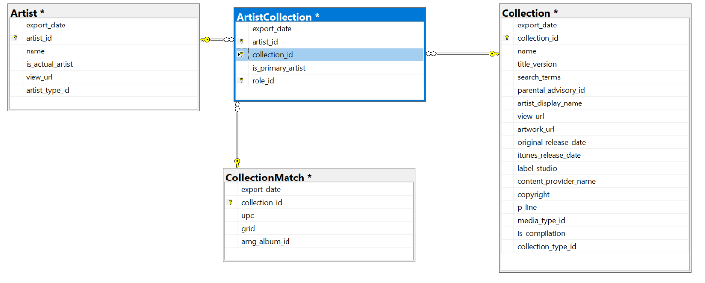

# DataIngestion

A time-constrained (partial)solution to meet the following spec:


# DataIngestion Challenge

### Task desciption:
- The task is to store music data in Searchable database - ElasticSearch - 
- In google drive folder https://drive.google.com/drive/folders/1RkUWkw9W0bijf7GOgV4ceiFppEpeXWGv, there are 4 compressed files representing 4 database tables extracted from relational database.
- The files are (Artist - ArtistCollection - Collection - CollectionMatch)
- We would like the solution to download, extract and read the files then inject Collection object into ElasticSearch index named albums
- Album Object should be like this

```
{
  "id": "1255407551",
  "name": "Nishana - Single",
  "url": "http://ms.com/album/nishana-single/1255407551?uo=5",
  "upc": "191061793557", // found in CollectionMatch file
  "releaseDate": "2017-06-10T00:00:00",
  "isCompilation": false,
  "label": "Aark Records",
  "imageUrl": "http://img.com/image/thumb/Music117/v4/92/b8/51/92b85100-13c8-8fa4-0856-bb27276fdf87/191061793557.jpg/170x170bb.jpg",
  "artists": [
    {
      "id": "935585671",
      "name": "Anmol Dhaliwal"
    }
  ]
}
```



### Prerequisites:
- Docker
- ElasticSearch http://localhost:9200/. it can be configured using docker image

### Requirments:
- Use dotnet core Console application
- If you stuck in downloading or extracting the files programatically, you can do it manually
- You are allowed to use any technology you would like to use (AzureEventhub, EMQ, SqlServer, etc..)
- Feel free to design your solution in one or more microservices/console apps
- Solution should be testable, we are not looking for 100% code coverage but show examples of how you make parts unit-testable.
- You are free to use third-party libraries

We want to get a better understanding of:
- The code you produce
- How you go about architecting an extensible solution!

### Notes:
- Please don't make it more complex than necessary.
- We would like to see a piece of code as you would do on your normal working day.
- Please don't fork this project and create your own repository.
- Please send us whatever you have done before the deadline even if it is an incompleted task.
- Don't hesitate to contact us for questions and support while working on the task.


# Notes/Assumptions

- In an effort to keep it simple, and minimise dev time, parts of it are coded in a non-production way. Eg. In-memory data collections rather that a DB store. 
- I felt that setting up Microservices and even a DB store was overkill, and would have extended the time further
  - However, I didn't appreciate the size of the input files when I designed the solution
- Retrieving data from the Google drive wasn't straightforward due to a Virus scan message & subsequent confirmation.
    - The GoogleDrive API documentation was geared towards an owned project/application, so I wasn't sure how that would apply to a shared folder
- The solution works for the smaller input files but is failing "Stream too long" on at least one of the larger ones when decompressing. 
    - Given more time I might have explored different Decompression techniques
- What is working:
   - SourceRepo/Downloads
   - Dependency Injection
   - ETL for smaller input files
     - Decompression
     - Data Parsing
     - Dto creation
  - AlbumBuilder successfully creates a collection of Album objects (tested via Unit tests). 
    - However, I feel that the in-memory approach taken would not be optimal given the size of the data and might fail if I was able to run against the input data once the decompression issue was resolved. In a production system I would use a local data-store - probably Entity Framework + SQL Server
  - The sample Unit tests I've created
- What is not working
   - ETL for larger input files
     - Decompression failing with "Stream too long" exception
   - Because of the above, Data parsing and Dto creation are not fully tested, but should work fine
     - Artist Data parsing and Dto creation tested via Unit Tests & working fine
- What is incomplete
   - The SearchRepo & Data upload
     - I didn't feel I had enough info to complete this
